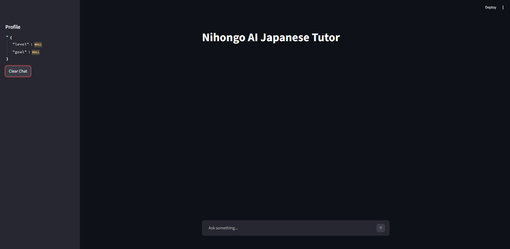
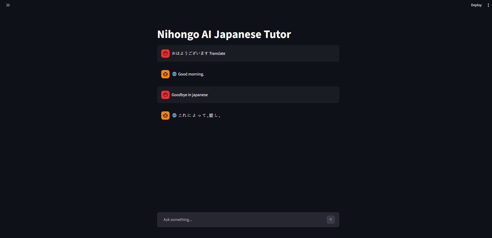
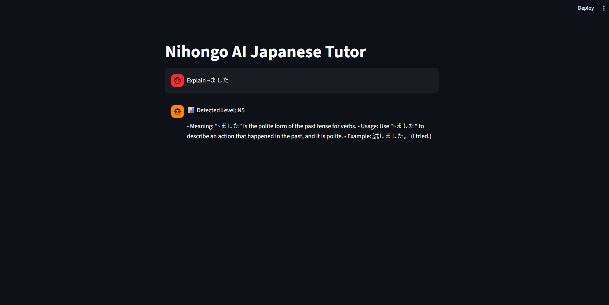
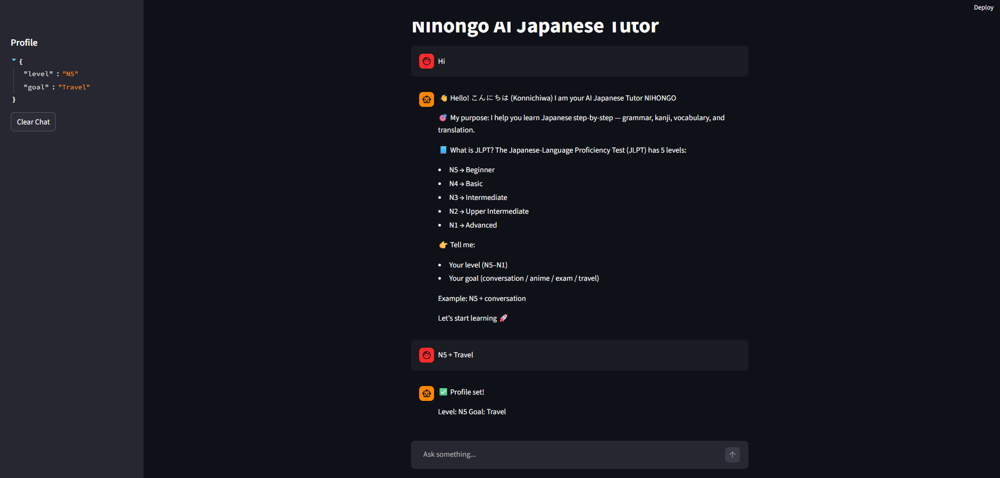
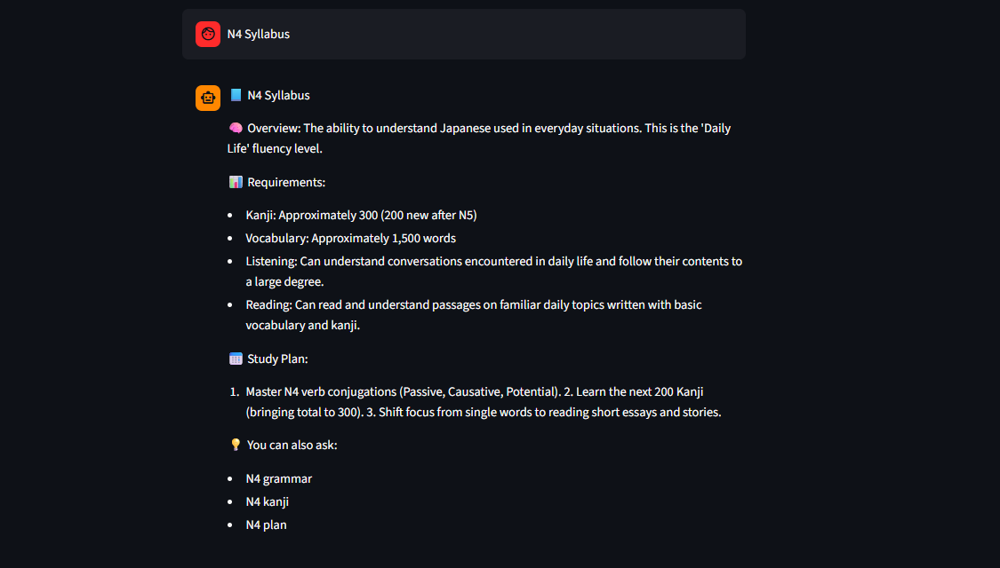
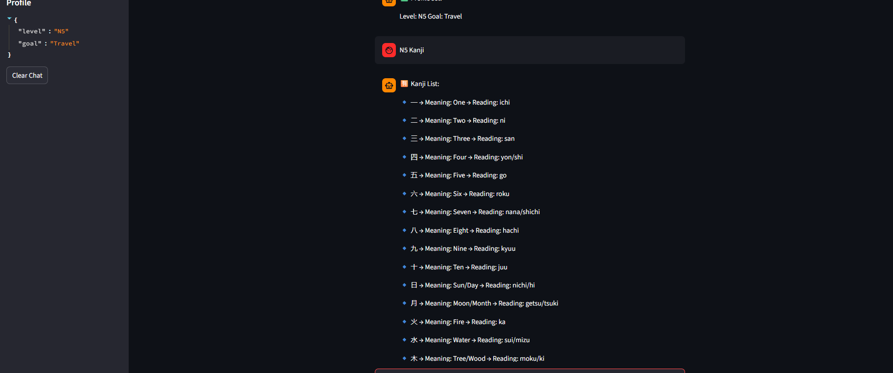

# 🚀 AI-Powered Japanese Learning Assistant (JLPT Tutor)

An end-to-end **AI + Machine Learning system** that helps users learn Japanese for the JLPT (N5 → N1) using:

- 🧠 AI-based grammar explanations  
- 🈶 Kanji learning with meanings & readings  
- 🌐 Context-aware translation (casual / polite / formal)  
- 📊 JLPT level detection using BERT  
- 🔍 RAG (Retrieval-Augmented Generation) system  
- 📈 Semantic evaluation for accuracy  

---

# 🎯 Problem Statement

Learning Japanese for the JLPT is challenging because:

- Grammar is complex and context-dependent  
- Kanji memorization is difficult  
- Translation tools are often inaccurate  
- No single tool combines syllabus + explanation + practice  

👉 This project solves this by building an **AI tutor that adapts to user level and learning goals**.

---

# 💡 Solution Overview
```
User Query
↓
Intent Detection (Translate / Grammar / Kanji / Syllabus)
↓
BERT Level Classifier (N5–N1)
↓
Hybrid Retrieval (FAISS + BM25)
↓
Re-ranking (Cross Encoder)
↓
LLM (Groq LLaMA)
↓
Formatted Output

```


---

# 🚀 Features

## 🧩 JLPT Syllabus (N5 → N1)
- Structured syllabus
- Grammar + Kanji + Vocabulary
- Study plans

---

## 🈶 Kanji Learning
- Meaning + readings
- Clean structured display
- Beginner → advanced kanji

---

## 🧠 Grammar Explanation
- Short, clear explanations  
- Example-based learning  
- Adaptive to difficulty  

---

## 🌐 Smart Translation
- English ↔ Japanese  
- Supports:
  - ✅ Polite  
  - ✅ Casual  
  - ✅ Formal  

Example:

```
translate I am happy → 私は嬉しいです。
translate I am happy casual → 嬉しい
```


---

## 📊 JLPT Level Detection (BERT)
- Automatically detects level:


```
📊 Detected Level: N4

```


---

## 🔍 Hybrid RAG System
- FAISS → semantic search  
- BM25 → keyword search  
- Combined retrieval  

---

## 🔥 Re-Ranking Model
- Cross-encoder improves accuracy  

---

## 📈 Semantic Evaluation
- Embedding-based scoring  
- Handles paraphrasing + spelling mistakes  

---

## 💾 Personalization
- Stores user level + goal  
- Adapts responses  

---

## 🐳 Docker Support
- Fully containerized  
- Easy deployment  

---

# 🧠 ML Models Used

- BERT → JLPT level classification  
- Sentence Transformers → embeddings  
- Cross Encoder → re-ranking  
- Helsinki-NLP → translation  
- LLaMA (Groq API) → response generation  

---

# 🏗️ Architecture

```

            +----------------------+
            |     User Query       |
            +----------+-----------+
                       |
                       v
        +---------------------------+
        | Intent + Level Detection  |
        +---------------------------+
                |          |
                v          v
     +------------+   +------------+
     |  RAG DB    |   | Translator |
     +------------+   +------------+
            |
            v
    +------------------+
    | Re-ranking Model |
    +------------------+
            |
            v
    +------------------+
    | LLM (Groq LLaMA) |
    +------------------+
            |
            v
    +------------------+
    | Formatted Output |
    +------------------+

```


---

# 🖥️ Screenshots

## 🏠 Home Screen


---

## 🌐 Translation


---

## 🧠 Grammar Explanation


---

## 📊 Level Detection


---

---

## 🧠 Syllabus


---

---

## 🈶 Kanji Output


---

## ✈️ Plan


---

# ⚙️ Tech Stack

- Python  
- Transformers (HuggingFace)  
- LangChain  
- FAISS  
- BM25  
- Groq API  
- Streamlit  
- Docker  

---

# 🚀 Setup

## 1. Clone Repo
```bash
git clone https://github.com/your-username/japanese-ai-bot
cd japanese-ai-bot
```


## 2. Install Dependencies
```bash
pip install -r requirements.txt

```
## 3. Add Environment Variable (.env)
```bash
GROQ_API_KEY=your_api_key
```
## 4. Run App
```bash
streamlit run app.py
```
## 🐳 Docker
```bash
docker build -t japanese-ai-bot .
docker run -p 8501:8501 japanese-ai-bot
```
---

## 📈 Evaluation & Performance

The system was evaluated based on retrieval accuracy and response generation quality.

| Metric | Score / Status | Description |
| :--- | :--- | :--- |
| **Semantic Accuracy** | `~0.82` | Cosine similarity score between AI response and gold-standard syllabus. |
| **Latency** | `~1–2s` | Average response time using Groq LLaMA-3 acceleration. |
| **Translation Quality** | **High** | Verified against Helsinki-NLP benchmarks for EN-JP pairs. |

---

## 🔮 Future Improvements

- [ ] **📚 Complete JLPT Dataset:** Expand vector store to include all 2,000+ Joyo Kanji.
- [ ] **🧠 Quiz System:** Implementation of a Spaced Repetition System (SRS) like Anki or Duolingo.
- [ ] **🌍 Multi-language Support:** Support for Spanish, Chinese, and Korean speakers.
- [ ] **📊 Confidence Scores:** Add a UI indicator for how "sure" the model is of a grammar explanation.
- [ ] **🔁 Feedback Loop:** Allow users to "thumbs up/down" to fine-tune future RAG results.
- [ ] **🤖 LoRA Fine-tuning:** Domain-specific fine-tuning of LLaMA on formal *Keigo* datasets.
- [ ] **⚡ CI/CD Pipeline:** Automated testing and deployment using GitHub Actions.

---

## 💯 Key Project Highlights

*   **End-to-End ML System:** Integrated pipeline from raw data processing to UI deployment.
*   **Hybrid RAG + Re-ranking:** Sophisticated retrieval using both semantic (FAISS) and lexical (BM25) search.
*   **Semantic Evaluation:** Moving beyond simple string matching to evaluate AI output based on meaning.
*   **Multi-Model Integration:** Orchestration of BERT, Sentence-Transformers, and LLaMA via LangChain.
*   **Real-World Application:** A functional tool designed to solve actual pain points for language learners.

---

**If you found this project helpful, please consider giving it a ⭐!**

